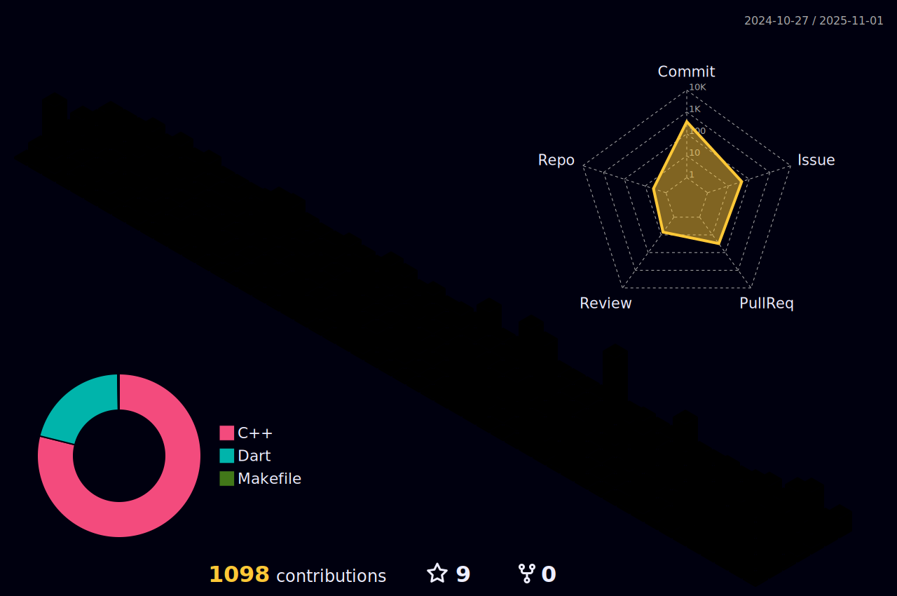

# 👋 Welcome to My GitHub Profile!

### 🎓 I'm an [Epitech](https://www.epitech.eu/) student, an engineering school specializing in computer science. My primary focus is on software development with C/C++.

### 🔬 In my spare time, I explore graphic development with Vulkan and delve into 3D environment creation.

### 🔌 Let's Connect!

### 🛠️ Technologies & Tools I Use

